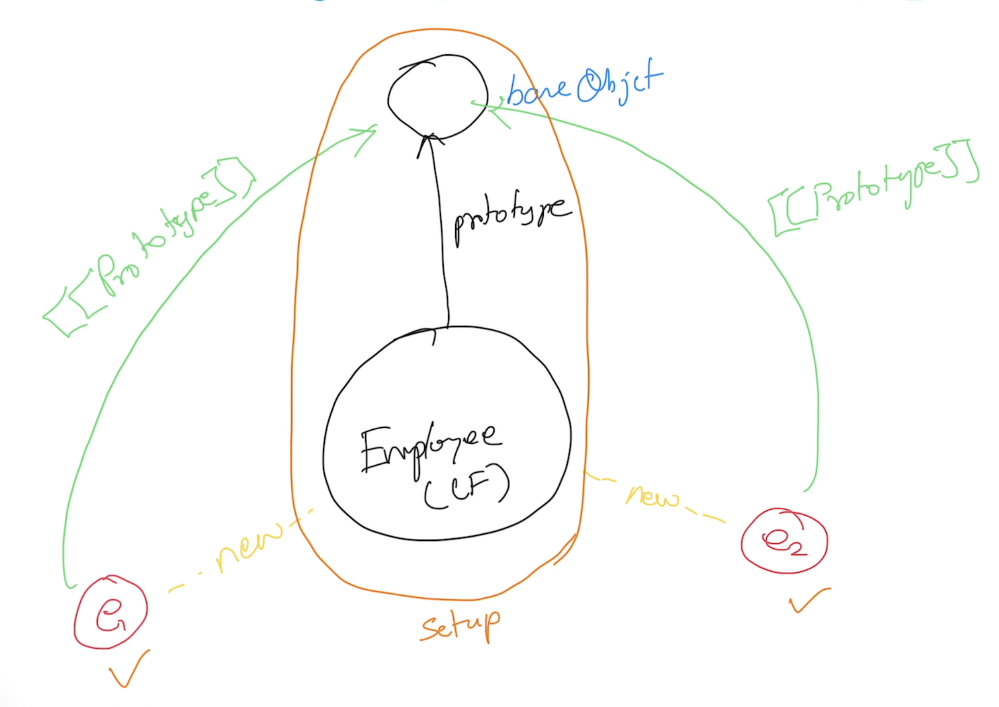

# Advanced JavaScript

## Me
- tkmagesh77@gmail.com
- 99019-11221

## Schedule
| What | When |
| --- | ---|
| Commence | 9:30 AM |
| Tea Break | 11:00 AM (20 mins) |
| Lunch Break | 1:00 PM (1 hr) |
| Tea Break | 3:30 PM (20 mins) |
| Wind up | 5:30 PM |

## Methodology
- No powerpoint
- Code & Discuss

## Repository
- https://github.com/tkmagesh/adobe-advjs-feb-2026

## Software Prerequisites
- Node.js (LTS)
- Visual Studio Code
- Chrome Browser

## TypeScript
- Type Safe JavaScript (In Scope)
- Building Type System / Type level typescript (Out of scope)

## JavaScript

### Language Categories
- Line Oriented (GW Basic, Fortran)
- Procedural (C, COBOL)
- Object Based (Visual Basic)
- Object Oriented (C++, Java, C#)
- Functional (Scala, Haskel, F#)

JavaScript = Loosely Typed + Object Based + Functional

```js
// loosely typed
let x;
x = 100
x = "Esse esse cupidatat labore reprehenderit ea enim anim laboris exercitation ipsum duis."
x = true
x = {}
x = function(){}
x = []
```

## When a function is invoked
There are 2 implicit values passed to the function
- arguments
    - array **like** object with all the arguments passed to the function
- this
    - invocation context

## Functional
- In a functional language, functions are NOT mere programming constructs (if, for, switch-case) BUT they can be treated like data (object)

### Function Invocation Patterns
- It DOES NOT matter **WHERE** a function is OR who **OWNS** the function
- What matters is **HOW** the function is **INVOKED**

#### 6 different ways of a function
- As a function
    - this -> global scope (globalThis), it is 'window' in the browser
- As a method of an object
    - `this` -> object 
- Using the 'call' method of the function
- Using the 'apply' method of the function
- Using the 'new' keyword (typically contructor functions)
    - `this` => new object
    - `this` => returned by default
    ```js
        function Employee(id, name, salary){
            // `this` => new object
            this.id = id;
            this.name = name;
            this.salary = salary;
            // `this` => returned by default
        }
            
        
        let emp = new Employee(100, 'Magesh', 10000)
        console.log(emp)
        console.log(emp.constructor)
        console.log(emp instanceof Employee)
        console.log(emp.constructor === Employee)
    ```
- Immediately Invoked Function Expression (IIFE)

### Inheritance
- `prototypal` inheritance




